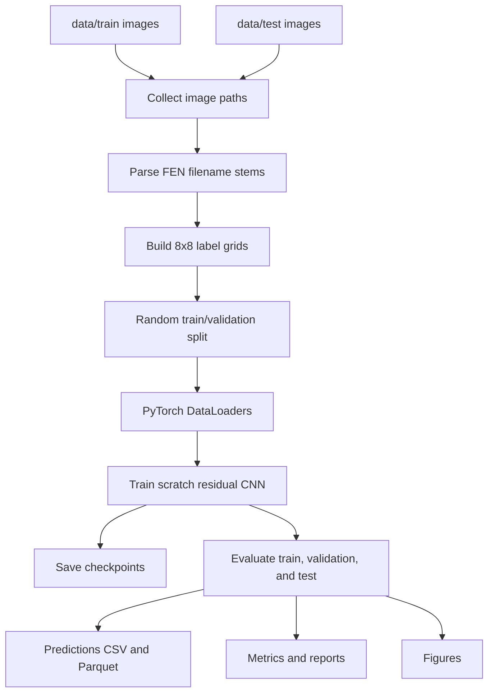
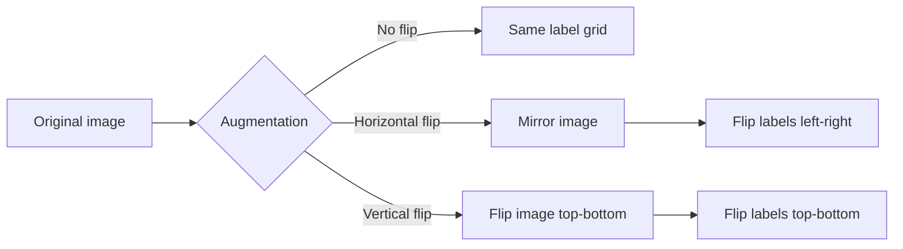
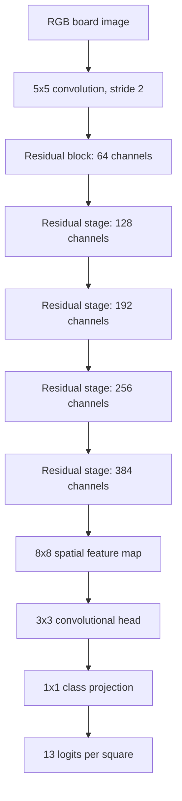
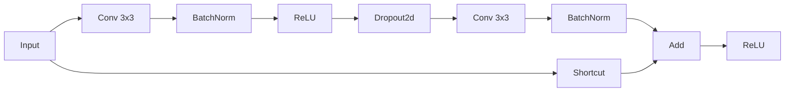
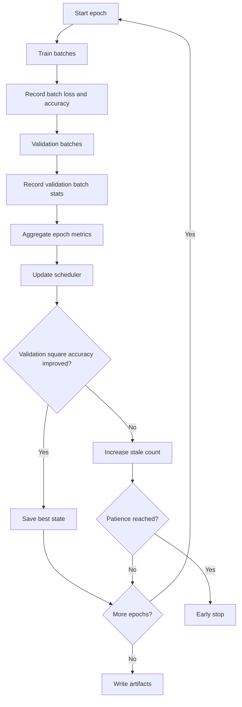

# Chess Position Recognition with a Scratch PyTorch CNN

_Recognizing every piece on a chessboard image is not only an image classification problem. It is a structured prediction problem: the model must understand a full board, preserve square locations, and make 64 coordinated decisions from one image._

## Abstract

This project builds an end-to-end chess position recognition pipeline with raw PyTorch. Given a schematic chessboard image, the model predicts the piece or empty state for each of the 64 squares. Labels are parsed directly from FEN-like filenames in the Kaggle Chess Positions dataset, and the model is trained from scratch with no fastai, no pretrained models, no pretrained weights, and no transfer learning.

The implementation is intentionally command-driven and reproducible. The root script, `cpr.py`, reads local images from `data/train/` and `data/test/` on every run, performs a random validation split from the training directory, trains one residual convolutional neural network, evaluates validation and test performance, and writes report-ready metrics, predictions, figures, and checkpoints under `output/`.

The current article is prepared before the final long GPU training run is complete. Final metric values, plots, and qualitative error analysis are marked with placeholders and should be filled after `just run` finishes on the target RTX 4080 setup.

## Why This Problem Matters

Chess position recognition is a useful small-scale vision problem because it combines three constraints that are common in real systems:

- The input is visual, but the output is structured.
- Predictions must preserve spatial alignment.
- Some classes are rare, while one class, `empty`, dominates many squares.

A naive classifier could crop the board into 64 square images and classify each square independently. That approach is simple, but it throws away board-level context and creates extra preprocessing assumptions. This project instead trains one neural network that receives the whole board image and emits one prediction per square. The model learns visual features across the entire board while preserving an 8 by 8 spatial output grid.

The task is also constrained enough to evaluate precisely. Every input image has 64 square labels, so the model can be measured at the square level, occupied-square level, empty-square level, full-board level, and per-class level.

## Problem Definition

The recognition target is the state of every board square.

| Field | Definition |
| --- | --- |
| Input | One RGB chessboard image |
| Output | 64 square labels arranged as an 8 by 8 board |
| Classes | `empty`, six white pieces, six black pieces |
| Primary metric | Square-level accuracy |
| Final evaluation | Held-out images from `data/test/` |

The class set contains 13 labels:

| Class Group | Labels |
| --- | --- |
| Empty | `empty` |
| White pieces | `P`, `N`, `B`, `R`, `Q`, `K` |
| Black pieces | `p`, `n`, `b`, `r`, `q`, `k` |

This is not ordinary 13-class image classification. A single board image produces 64 simultaneous 13-class predictions. In tensor form, the model output is shaped like `[batch, 13, 8, 8]`, where each spatial cell corresponds to one square of the board.

## Dataset

The dataset used in this project is [Chess Positions](https://www.kaggle.com/datasets/koryakinp/chess-positions). It contains schematic chessboard images where the filename encodes the full board position.

The local expected layout is:

| Path | Purpose |
| --- | --- |
| `data/train/` | Training and validation source images |
| `data/test/` | Final held-out test images |

The project does not implement a Kaggle download step. The image files must already exist locally before running the pipeline.

### Label Encoding in Filenames

Each image filename stem is a FEN board description with dashes instead of slashes. For example, a normal FEN board section uses eight ranks separated by `/`; this dataset stores those ranks separated by `-`.

The parser expands each rank into eight square labels:

- Piece letters become their corresponding piece classes.
- Digits become repeated `empty` labels.
- Eight ranks become an 8 by 8 target grid.

Example mapping:

```text
rnbqkbnr-pppppppp-8-8-8-8-PPPPPPPP-RNBQKBNR
```

becomes eight ranks, where `8` expands to eight empty squares.

This design avoids a separate annotation file. The raw image path is enough to recover the complete target board.

## Data Contract

The pipeline assumes the dataset follows a strict contract:

| Component | Requirement |
| --- | --- |
| Image | RGB board image representing one full aligned board |
| Filename stem | Eight dash-separated FEN ranks |
| Rank width | Each expanded rank must contain exactly eight squares |
| Label grid | 8 by 8 integer class grid |
| Split | Training and validation from `data/train/`; final test from `data/test/` |

If a filename does not contain exactly eight ranks, contains an invalid FEN character, or expands to a rank width other than eight, the pipeline fails early with an explicit error. This is deliberate: silent label corruption would make the final metrics meaningless.

## End-to-End Pipeline

The full pipeline is implemented in `cpr.py`. It is designed to be rerun from raw local files without writing a processed dataset cache.



The command interface is intentionally small:

```bash
just sync
just run
```

For quick verification without a full GPU training run:

```bash
just smoke
```

The smoke command runs a one-epoch CPU configuration with a small row limit. It is not meant to produce final quality; it verifies that data loading, training, evaluation, and artifact generation still work.

## Image Processing and Augmentation

Each image is opened as RGB, resized to the configured square input size, converted to a tensor, and normalized to `[-1, 1]` using channel mean and standard deviation values of `0.5`.

Training-time augmentation is intentionally label-preserving:

| Augmentation | Image operation | Target operation |
| --- | --- | --- |
| Horizontal flip | Mirror image left-right | Flip label grid left-right |
| Vertical flip | Flip image top-bottom | Flip label grid top-bottom |
| Brightness jitter | Change image brightness | No target change |
| Contrast jitter | Change image contrast | No target change |
| Color jitter | Change image saturation/color | No target change |

The flip operations are the most important detail. If the image is mirrored but the 8 by 8 label grid is not mirrored in the same direction, the training example becomes wrong. The model would be penalized for predicting the visually correct square because the target would still describe the original unflipped board.



This matters because the output is spatial. Classification labels are not independent metadata; they are tied to square coordinates.

## Why a Whole-Board CNN Instead of Cropping?

There are two obvious ways to solve this task.

| Approach | Strength | Weakness |
| --- | --- | --- |
| Crop 64 squares, classify each crop | Simple mental model; direct square classifier | Requires exact square extraction; loses board context; runs classifier 64 times or builds separate crop dataset |
| Whole-board CNN with 8 by 8 output | Keeps global board context; one forward pass; labels remain spatial | Requires model output to align with board squares |

This project uses the second approach. It fits the dataset well because every image is a full aligned schematic board. A whole-board model can learn features at different scales: board colors and grid lines at early layers, piece shapes at intermediate layers, and square-level class logits at the output.

## Model Architecture

The active model is `BoardCNN`, a scratch residual convolutional network. The design goal is to reduce the input image into an 8 by 8 feature grid, then classify each grid cell into one of 13 square states.



At a high level:

- The input is a normalized RGB board image.
- Convolutional stages progressively downsample the image.
- Residual blocks improve optimization by allowing identity shortcuts.
- Dropout regularizes convolutional features.
- The classification head emits 13 channels at each board-square location.
- If the spatial output is not exactly 8 by 8, adaptive average pooling forces the final grid to match the board shape.

### Residual Blocks

Each residual block contains two convolutional layers with batch normalization and ReLU activation. The input is added back through a shortcut path before the final activation.



When channel count or resolution changes, the shortcut uses a 1 by 1 convolution with matching stride. Otherwise, it is an identity path.

Residual connections are valuable here because the model is deeper than a minimal CNN. They make gradient flow more stable and allow later layers to refine features instead of relearning everything from scratch.

### Spatial Alignment

The core architectural idea is that the model should preserve a meaningful spatial grid. The final 8 by 8 tensor is interpreted as the chessboard:

| Tensor location | Board meaning |
| --- | --- |
| `[0, 0]` | Top-left square from the image |
| `[0, 7]` | Top-right square from the image |
| `[7, 0]` | Bottom-left square from the image |
| `[7, 7]` | Bottom-right square from the image |

The model does not output a flat vector of 64 unrelated predictions. It outputs a spatial map, which makes the inductive bias closer to the problem structure.

### Classification Head

The classification head is fully convolutional:

- A 3 by 3 convolution mixes local square-neighborhood features.
- Batch normalization and ReLU stabilize and activate the head representation.
- Dropout reduces overfitting.
- A final 1 by 1 convolution projects each square location to 13 class logits.

The 1 by 1 projection is important: it treats each 8 by 8 feature cell as a learned square descriptor and maps that descriptor to class scores.

## Loss Function and Class Imbalance

The model is trained with cross-entropy loss over the 13 square classes. Since empty squares are frequent, the empty class receives a lower loss weight through `EMPTY_CLASS_WEIGHT`.

This is a practical compromise. If empty squares dominate the loss too strongly, the model can improve square accuracy by becoming conservative and predicting empty too often. Occupied-square accuracy is tracked separately to expose this failure mode.

The loss also uses small label smoothing. Label smoothing can reduce overconfidence and make optimization less brittle, especially when many visually similar pieces exist.

## Training Configuration

Important training constants live near the top of `cpr.py` and are mirrored in the project documentation.

| Setting | Purpose |
| --- | --- |
| `BATCH_SIZE` | Number of board images per mini-batch |
| `IMAGE_SIZE` | Resized input side length |
| `LEARNING_RATE` | AdamW learning rate |
| `WEIGHT_DECAY` | AdamW regularization |
| `DROPOUT` | Convolutional dropout strength |
| `LABEL_SMOOTHING` | Cross-entropy smoothing |
| `EMPTY_CLASS_WEIGHT` | Empty-square loss weight |
| `PATIENCE` | Early stopping patience |
| `MIXED_PRECISION` | CUDA automatic mixed precision |

The optimizer is AdamW. A `ReduceLROnPlateau` scheduler lowers the learning rate when validation loss stops improving. The best checkpoint is selected by validation square accuracy, because square accuracy is the primary metric for the task.

## Training Loop

The training loop records both epoch-level and batch-level history.



Every batch records:

- batch loss;
- square accuracy;
- occupied-square accuracy;
- board accuracy;
- running loss;
- running square accuracy;
- running occupied-square accuracy;
- running board accuracy.

The generated batch history is written to:

- `output/reports/training_batch_history.csv`
- `output/reports/training_batch_history.md`

The generated training plots include every-batch curves:

- `output/figures/training_loss.png`
- `output/figures/training_accuracy.png`
- `output/figures/batch_loss.png`
- `output/figures/batch_accuracy.png`

## Evaluation Metrics

The project reports several complementary metrics because one number is not enough to understand this task.

| Metric | What it measures | Why it matters |
| --- | --- | --- |
| Square accuracy | Fraction of all 64 square labels predicted correctly | Primary objective |
| Occupied-square accuracy | Accuracy on non-empty squares only | Measures actual piece recognition quality |
| Empty-square accuracy | Accuracy on empty squares only | Detects empty-square behavior |
| Board accuracy | Fraction of boards with all 64 squares correct | Strict end-to-end board reconstruction |
| Per-class precision/recall/F1 | Class-specific behavior | Reveals weak pieces and color confusions |
| Confusion matrix | Pairwise class error structure | Shows systematic mistakes |

Board accuracy is intentionally strict. A board with 63 correct squares and one wrong square is counted as incorrect at the board level. This metric is useful because the final board position is only fully correct when every square is correct.

## Results

The final training run is still in progress. This section should be completed after the extended GPU run finishes and the output artifacts are regenerated.

### Final Metrics Placeholder

Replace the `TODO` values with the final values from `output/reports/metrics.csv` or `output/reports/metrics.json`.

| Split | Square Accuracy | Occupied-Square Accuracy | Empty-Square Accuracy | Board Accuracy |
| --- | --- | --- | --- | --- |
| Train | TODO | TODO | TODO | TODO |
| Validation | TODO | TODO | TODO | TODO |
| Test | TODO | TODO | TODO | TODO |

### Training Curves Placeholder

Insert or reference the final plots after `just run` completes:

- `output/figures/training_loss.png`
- `output/figures/training_accuracy.png`
- `output/figures/batch_loss.png`
- `output/figures/batch_accuracy.png`

Suggested interpretation to fill later:

- Did training loss decrease smoothly?
- Did validation loss plateau or diverge?
- Did batch-level accuracy stabilize after early noisy batches?
- Did validation occupied-square accuracy improve at the same pace as square accuracy?

### Confusion Matrix Placeholder

Insert or reference:

- `output/figures/confusion_matrix.png`

Questions to answer after the final run:

- Which pieces are confused most often?
- Are white and black versions of the same piece confused?
- Are rare pieces such as kings and queens underrepresented in errors or simply low-support classes?
- Is the model predicting `empty` too often for occupied squares?

### Prediction Confidence Placeholder

Insert or reference:

- `output/figures/prediction_confidence.png`

Questions to answer after the final run:

- Are correct predictions generally high confidence?
- Are errors also high confidence, suggesting calibration issues?
- Is confidence lower on occupied squares than empty squares?

### Class Distribution Placeholder

Insert or reference:

- `output/figures/class_distribution.png`

Use this plot to explain class imbalance, especially the dominance of `empty` squares compared with individual piece classes.

## Expected Challenges

Several challenges make this task more interesting than it first appears.

### 1. Empty Squares Dominate the Dataset

Many board positions contain more empty squares than occupied squares. A model can achieve deceptively high square accuracy by learning empty squares well while still misclassifying pieces. This is why occupied-square accuracy is reported separately and the empty class is down-weighted in the loss.

### 2. Rare Classes Have Less Signal

Kings and queens appear less frequently than empty squares and pawns. Per-class precision, recall, and F1 are needed to avoid hiding weak rare-class behavior behind global accuracy.

### 3. Visual Similarity Between Pieces

Some pieces can be visually similar in schematic board images, especially at reduced resolution. Bishops, queens, and kings may share visual motifs. Rooks and pawns are usually easier, but this depends on the exact piece set in the dataset.

### 4. Spatial Alignment Must Be Preserved

The target label for a square is meaningful only if the model output cell corresponds to the same square. Augmentation, resizing, and output pooling must preserve the board structure.

### 5. Full-Board Accuracy Is Harsh

Even a high square accuracy can produce modest board accuracy. For example, independent 99% square accuracy would still imply roughly `0.99^64`, or about 52.6% full-board accuracy under a simplifying independence assumption. Full-board reconstruction is therefore much stricter than square classification.

## Reproducibility

Run the complete pipeline with:

```bash
just sync
just run
```

Run a short CPU smoke check with:

```bash
just smoke
```

Run formatting and lint checks with:

```bash
just check
```

Build the presentation after plots are regenerated:

```bash
nix develop -c just presentation-build
```

The main generated artifacts are:

| Output | Path |
| --- | --- |
| Best model checkpoint | `output/models/scratch_board_cnn.pt` |
| Epoch history | `output/reports/training_history.csv` |
| Batch history | `output/reports/training_batch_history.csv` |
| Predictions | `output/predictions/predictions.csv` and `.parquet` |
| Metrics | `output/reports/metrics.csv` and `.json` |
| Class report | `output/reports/class_report.csv` |
| Figures | `output/figures/` |

## Limitations

The current system is deliberately focused and has clear limitations.

- It assumes aligned full-board schematic images matching the Kaggle dataset style.
- It does not detect board corners or perform perspective correction.
- It does not train on photographs of physical boards.
- It uses one scratch CNN architecture, not an ensemble.
- It does not use pretrained visual features.
- It does not model chess legality or enforce valid board positions after prediction.
- It resizes images to `IMAGE_SIZE`, so piece detail depends on that setting.

These limitations are acceptable for the project scope because the goal is not a universal chessboard scanner. The goal is a reproducible deep learning pipeline for square-level recognition on schematic board images.

## Future Work

Several improvements are natural next steps after the final baseline is evaluated.

### Hyperparameter Tuning

The most important settings to tune are `IMAGE_SIZE`, `BATCH_SIZE`, `LEARNING_RATE`, `DROPOUT`, and `EMPTY_CLASS_WEIGHT`. The current implementation makes these constants easy to edit before running a new experiment.

### Calibration Analysis

The project already writes prediction confidence values. A future extension could add reliability diagrams, expected calibration error, and confidence breakdowns for occupied versus empty squares.

### Error Examples

The reports could include high-confidence mistakes and representative low-confidence boards. These examples would make model behavior easier to interpret than metrics alone.

### Post-Processing with Chess Constraints

Chess legality constraints could catch impossible predictions, such as too many kings or illegal piece counts. This should be treated carefully: post-processing may improve board validity, but it can also hide model errors. The raw square-level metrics should remain the primary evaluation signal.

### Architecture Comparisons

A second scratch CNN variant could be compared if the report requires architectural comparison. A lightweight alternative might use fewer residual stages, while a stronger variant could add attention or a larger head. Any comparison should keep the no-pretraining constraint intact.

## Conclusion

This project frames chess position recognition as structured square-level image recognition. A single scratch PyTorch CNN receives a full board image and predicts 13-class labels over an 8 by 8 output grid. The pipeline parses labels from filenames, applies label-preserving augmentation, trains with class-aware loss weighting, records batch-level and epoch-level history, and produces reproducible evaluation artifacts.

The final article results should be completed after the extended training run finishes. The key values to fill are validation and test square accuracy, occupied-square accuracy, empty-square accuracy, board accuracy, and the main observations from the generated training curves and confusion matrix.
