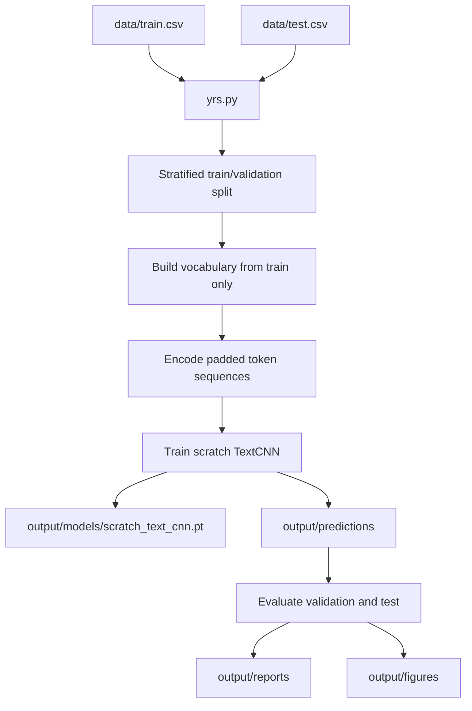
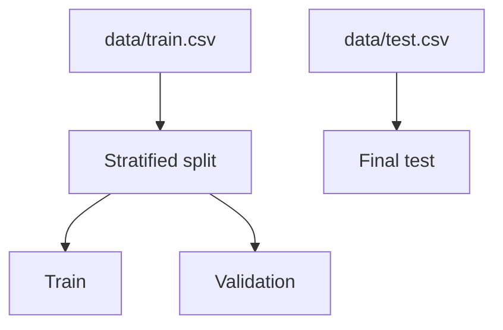
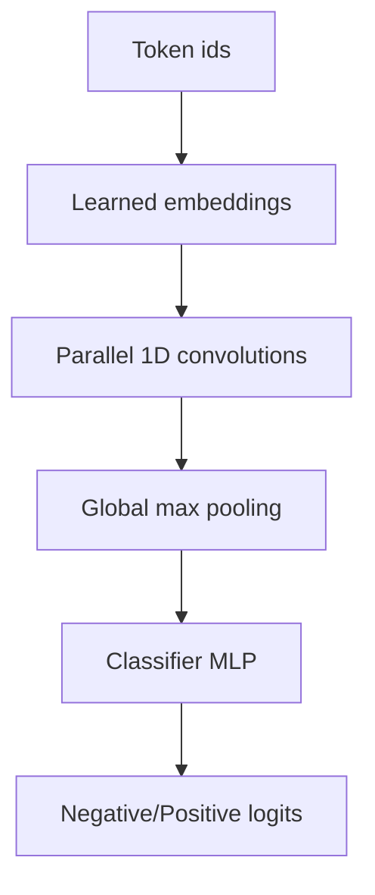

# Architecture

## Design Principles

- Reproducibility comes before convenience. Training and evaluation are command-driven by `yrs.py`.
- The target is binary Yelp review sentiment.
- Raw CSV files are read every run; no processed dataset cache is written.
- The final test CSV is isolated from vocabulary fitting, model training, and early stopping.
- Deep learning is implemented with raw PyTorch.
- fastai, pretrained embeddings, pretrained language models, transformer libraries, and language model APIs are not used.
- The active architecture is intentionally focused: one TextCNN over learned word embeddings and one classifier head.

## Decisions

| Area               | Decision                                            |
| ------------------ | --------------------------------------------------- |
| Script             | `yrs.py`                                            |
| Dataset            | Kaggle Yelp Review Dataset under `data/`            |
| Target             | Review polarity: `negative` or `positive`           |
| Modeling framework | Raw PyTorch                                         |
| Architecture       | Scratch TextCNN over learned word embeddings        |
| Validation         | Stratified split from `data/train.csv`              |
| Command interface  | `just run` wrapping `uv run python yrs.py`          |

## Data Flow

The pipeline has four responsibilities:

1. Read local Yelp CSV files.
2. Build an in-memory NLP representation from the active training split.
3. Train one scratch neural classifier.
4. Generate prediction, metric, report, and figure artifacts.

## Split Strategy

The validation split is stratified so negative and positive examples remain balanced. `data/test.csv` is loaded only for final evaluation.

## Text Processing Rules

| Step             | Rule                                                                           |
| ---------------- | ------------------------------------------------------------------------------ |
| Label mapping    | `1` to `negative`, `2` to `positive`                                           |
| Tokenization     | Lowercase regex tokenization for words, simple contractions, digits, punctuation |
| Vocabulary       | Built from the train split only                                                |
| Unknown tokens   | Out-of-vocabulary tokens map to `<unk>`                                        |
| Padding          | Sequences are padded or truncated to `MAX_SEQUENCE_LENGTH`                     |
| Augmentation     | Training-time word dropout replaces random non-padding tokens with `<unk>`     |

## Model

The model is `TextCNN` in `yrs.py`.

For each review:

- token ids are mapped to learned embeddings;
- parallel convolution filters with widths 2, 3, 4, and 5 detect sentiment phrases;
- global max pooling keeps the strongest activation per filter;
- a dropout-regularized MLP predicts binary sentiment logits.

The architecture is scratch-trained. There is no transfer from external model weights.

## Evaluation

Evaluation reports classification quality for train, validation, and test splits.

| Metric                        | Purpose                                      |
| ----------------------------- | -------------------------------------------- |
| Accuracy                      | Overall correct sentiment predictions        |
| Macro F1                      | Class-balanced quality                       |
| Log loss                      | Probability quality and confidence penalty   |
| Per-class precision/recall/F1 | Class-specific behavior                      |
| Confusion matrix              | Error structure across sentiment classes     |
