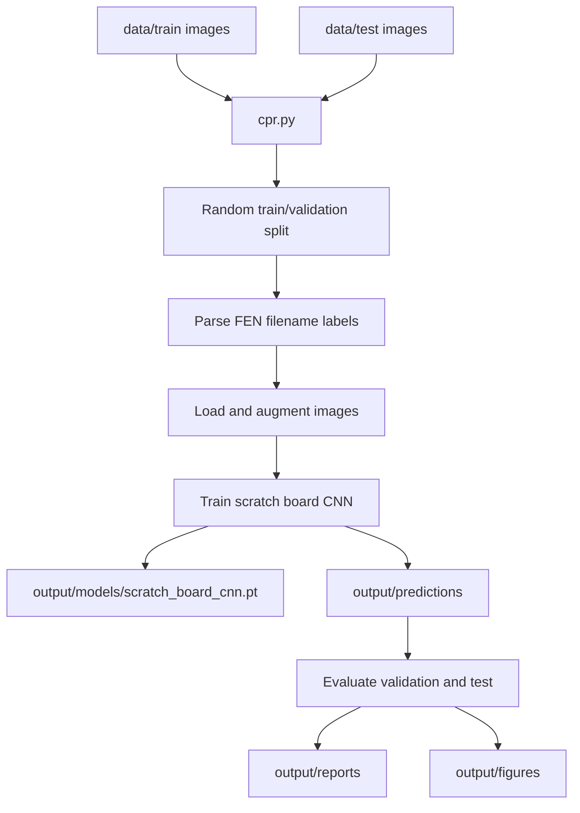
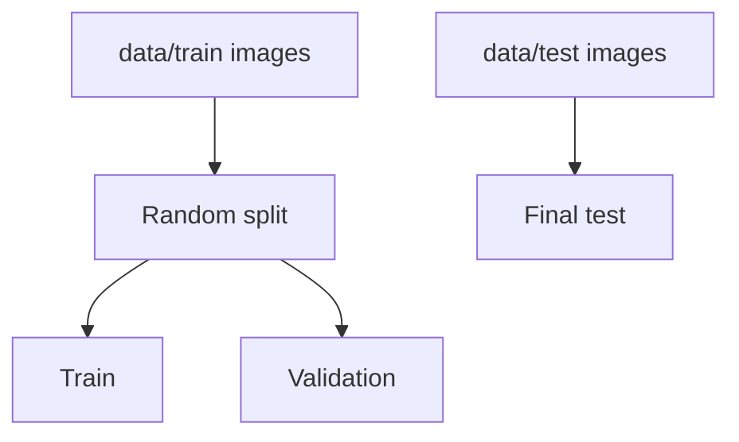
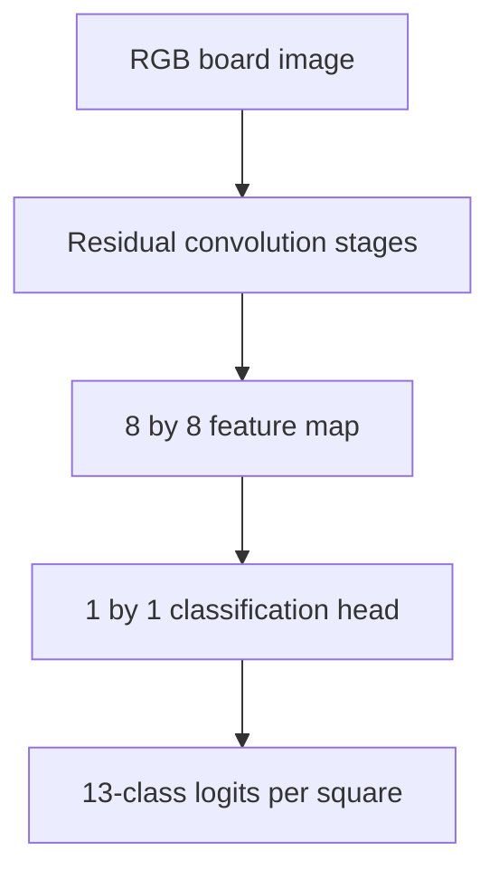

# Architecture

## Design Principles

- Reproducibility comes before convenience. Training and evaluation are command-driven by `cpr.py`.
- The target is chess square recognition across all 64 board squares.
- Raw image files are read every run; no processed dataset cache is written.
- The final test directory is isolated from model training and early stopping.
- Deep learning is implemented with raw PyTorch.
- fastai, pretrained models, pretrained weights, and transfer learning are not used.
- The active architecture is intentionally focused: one residual CNN with one 13-class output per square.

## Decisions

| Area               | Decision                                            |
| ------------------ | --------------------------------------------------- |
| Script             | `cpr.py`                                            |
| Dataset            | Kaggle Chess Positions under `data/`                |
| Target             | 64 square labels per board image                    |
| Modeling framework | Raw PyTorch                                         |
| Architecture       | Scratch residual board CNN                          |
| Validation         | Random split from `data/train/`                     |
| Command interface  | `just run` wrapping `uv run python cpr.py`          |

## Data Flow

The pipeline has four responsibilities:

1. Read local chessboard images.
2. Parse 64 square labels from filename stems.
3. Train one scratch neural classifier.
4. Generate prediction, metric, report, and figure artifacts.

## Split Strategy

The validation split is created from `data/train/`. `data/test/` is loaded only for final evaluation.

## Image Processing Rules

| Step             | Rule                                                                           |
| ---------------- | ------------------------------------------------------------------------------ |
| Label mapping    | FEN piece letters map to 12 piece classes; digits map to `empty` squares       |
| Image loading    | Files are opened as RGB images from `data/train/` or `data/test/`              |
| Resizing         | Images are resized to `IMAGE_SIZE` before tensor conversion                    |
| Normalization    | RGB channels are scaled to `[-1, 1]`                                           |
| Augmentation     | Training-time flips update the label grid; brightness/contrast/color preserve labels |

## Model

The model is `BoardCNN` in `cpr.py`.

For each board image:

- residual convolution stages learn board, square, and piece visual features;
- the spatial resolution is reduced to an 8 by 8 grid aligned with board squares;
- a convolutional classifier emits 13-class logits at each square location.

The architecture is scratch-trained. There is no transfer from external model weights.

## Evaluation

Evaluation reports classification quality for train, validation, and test splits.

| Metric                        | Purpose                                      |
| ----------------------------- | -------------------------------------------- |
| Square accuracy               | Primary metric for all 64 square predictions |
| Occupied-square accuracy      | Piece recognition quality excluding empty squares |
| Empty-square accuracy         | Empty square recognition quality             |
| Board accuracy                | Fraction of images with all 64 squares correct |
| Per-class precision/recall/F1 | Class-specific behavior                      |
| Confusion matrix              | Error structure across square classes        |
