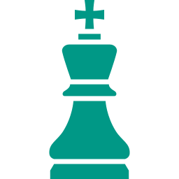

  

<h1 align="center" style="margin: 0;"> Chess Position Recognition </h1>

<h3 align="center" style="margin: 0.6em;">
    Recognizing chess pieces on every board square with scratch PyTorch CNN models.
</h3>

<h3 align="center" style="margin: 1em; margin-bottom: 3em;">
    <a href="https://oguzhanozkaya.github.io/chess-position-recognition/">Medium Article</a> - <a href="https://oguzhanozkaya.github.io/chess-position-recognition/">Presentation</a>
</h3>

-   ## Project

    This project predicts the piece or empty state for every square in a chessboard image. The implementation uses raw PyTorch only: image loading, FEN filename parsing, batching, augmentation, the neural architecture, optimization, evaluation, and artifact generation are implemented in `cpr.py` without fastai, pretrained models, or pretrained weights.

    **Dataset**: [Chess Positions](https://www.kaggle.com/datasets/koryakinp/chess-positions)

    **Student**: Oğuzhan Özkaya

    **Instructor**: Şafak Özden

    _ADA 447 Introduction to Deep Learning - TED University_

-   ## Objective

    Build a reproducible command-driven board recognizer that reads local chessboard images on each run, trains a scratch CNN, evaluates validation and test performance, and generates report-ready outputs.

-   ## Approach

    Parse square labels from dash-separated FEN filenames, apply label-preserving image augmentation, and train a residual convolutional network that emits one 13-class prediction for each board square. The model is optimized for square-level accuracy while also reporting occupied-square and full-board accuracy.

